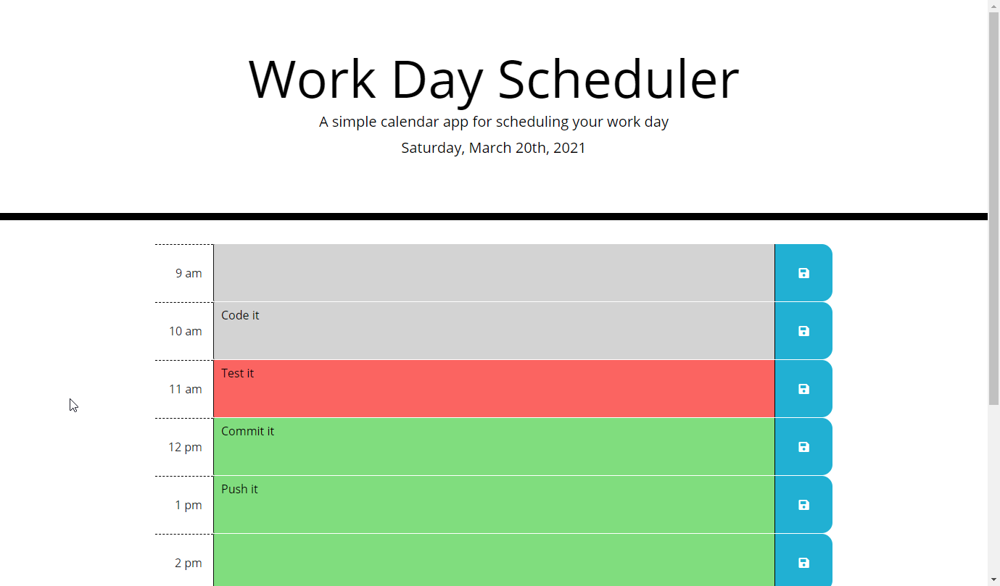

# **Work Day Scheduler**

&nbsp;
## **Description**
Work Day Scheduler is a straight to the point daily schedule tracking and planning web app. The application provides a distraction-free interface in which a user can enter and save task entries for the day in hour blocks. Time blocks are themed according to the time and delineate the schedule into quickly discernable past, present, or future sections to help a user stay on track. 

The website is created with HTML and styled using Bootstrap CSS classes plus additional custom CSS. Site functionality is implemented in JavaScript and makes use of additional libraries including jQuery and Moment.js. jQuery is use to to perform DOM traversal and manipulation, and Moment.js is used for time and date evaluations and formatting for text display. 

Work Day Scheduler is built as a single page web application and has its schedule blocks dynamically built and rendered to the screen on webpage load. For each hour block there is a textarea to enter a task description and a button to save the task to local storage. Upon page refresh saved tasks will be rendered to their saved time slot. A time monitor using the window setInterval method tracks the time and dynamically updates the schedule block themes at the change of every hour. 

&nbsp;
## **[Live Application](https://spfave.github.io/work-day-scheduler/)**

Demo interaction \

&nbsp;
## **Technologies and Services**
Web Technologies
- HTML5, CSS, and JavaScript
- Local Storage

External Frameworks and Services
- [Bootstrap](https://getbootstrap.com/) v4.3 front-end styling toolkit
- [jQuery](https://jquery.com/) v3.2
- [Moment.js](https://momentjs.com/) v2.24
- [icons8](https://icons8.com/) - <a target="_blank" href="https://icons8.com/icons/set/overtime">Schedule icon</a> icon by <a target="_blank" href="https://icons8.com">Icons8</a>